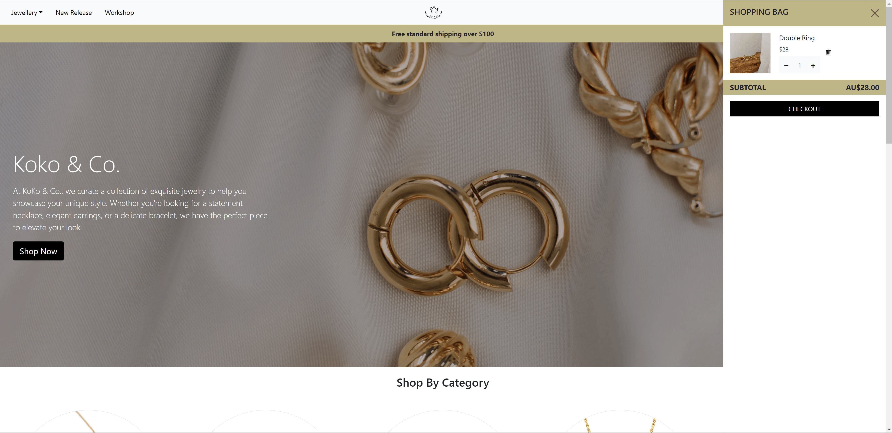

### APP Titile: Koko & Co.

### Overview: 
This project involves building a real-life e-commerce website for Koko&Co., a jewelry brand specializing in earrings, bracelets, rings, and necklaces. The website will be developed using React for the frontend and Node.js for the backend. The goal is to create a professional online presence that allows us to reach a broader audience and establish a loyal customer base.

### Background:
This project is my General Assembly (GA) capstone project, where I recently learned React. Developing this e-commerce website for Koko&Co. provides a great opportunity to apply my new skills and create a real-world application. Koko&Co. is a brand founded by my friend and me as a side hustle. We have been selling our jewelry products through irregular offline events. During these events, we received numerous requests from customers asking if we had an online store. Realizing the potential and demand for an online presence, we decided it was time to bring our brand to the digital world.

### Technology Stack: 
React + Node.js + Express + MongoDB + StripeAPI + AWS S3

### Getting Started
- 	[Wireframes](https://www.figma.com/design/Qdc4oj0InVHO1fayzd2j9i/GA_Project4%EF%BC%9A-Jewellery-E-commerce-website?node-id=0-1&t=wzI68T7lBrJA6sby-1)
- 	[ERD](https://miro.com/welcomeonboard/MHpxbGtwTWFCNENCbkZpcEpPeHV4ZjlIdDVwRzdmMFlhbDExTDNydXl2MUpPWXJJelVqT2l3anNnOHc5WW9pVXwzMDc0NDU3MzQ3NTgxOTY0ODMyfDI=?share_link_id=254373635289)
- 	[Deployed app](https://kokoandco.onrender.com)


```
username: kiki@gmail.com
password: 1234

payment card number: 4242424242424242
valid date, cvv and zip will make the payment successful
```

## Screenshots
Browsing</br>

Payment with Stripe</br>



### Next Steps:
1. show order history on users account
2. create workshop calendar and user can buy ticket
3. wish list
4. spinner for page loading
5. search bar
6. recommendations based on purchase or browsing history